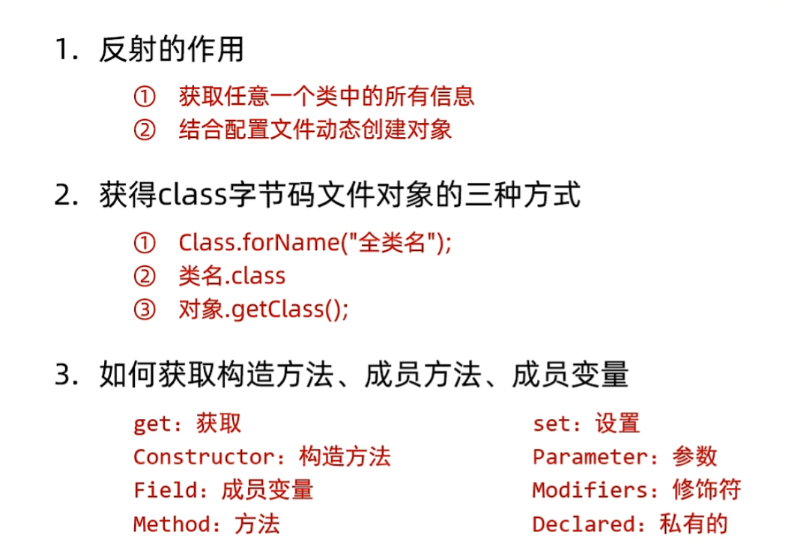

# 反射

**什么是反射？**

反射允许对成员变量，成员方法，和构造方法的信息进行编程访问

### 一、获取类信息

通过反射，可以在运行时获取类的各种信息，比如：

- **类的名称**：可以得到类的全限定名，包括包名和类名本身。例如，对于`java.util.Date`类，能通过反射获取到它完整的名称。
- **类的修饰符**：确定类是 public、private、abstract 等修饰符所限定的类型。
- **类的父类**：找出该类继承的父类信息。
- **实现的接口**：明确类实现了哪些接口。

```java
Class<?> clazz = Date.class;
System.out.println("类名: " + clazz.getName());
System.out.println("修饰符: " + Modifier.toString(clazz.getModifiers()));
System.out.println("父类: " + clazz.getSuperclass().getName());
System.out.println("实现的接口: ");
Class<?>[] interfaces = clazz.getInterfaces();
for (Class<?> anInterface : interfaces) {
    System.out.println(anInterface.getName());
}
```

### 二、创建对象

反射能够在运行时动态地创建类的对象，而不需要在编译时就明确知道要创建哪个具体类的对象。

```java
Class<?> clazz = SomeClass.class;
Object obj = clazz.newInstance(); 
// 注意：从Java 9开始，newInstance()方法已被标记为过时，推荐使用getConstructor().newInstance()的方式，如下
Constructor<?> constructor = clazz.getConstructor();
Object obj = constructor.newInstance();
```

这里的`SomeClass`可以是任何在运行时才能确定的类，通过反射就可以实例化它的对象。

### 三、访问和修改属性

可以获取类中定义的属性信息，并对属性进行访问和修改操作。

```java
Class<?> clazz = SomeClass.class;
Object obj = clazz.newInstance();

Field field = clazz.getDeclaredField("someField");
field.setAccessible(true); // 如果属性是private的，需要设置可访问

// 获取属性值
Object value = field.get(obj);

// 修改属性值
field.set(obj, newvalue);
```

### 四、调用方法

反射允许在运行时调用类的方法，不管是实例方法还是静态方法。

```java
Class<?> clazz = SomeClass.class;
Object obj = clazz.newInstance();

Method method = clazz.getDeclaredMethod("someMethod", argTypes);
method.setAccessible(true); // 如果是private方法，需设置可访问

// 调用实例方法
Object result = method.invoke(obj, args);

// 调用静态方法，此时obj可以为null
result = method.invoke(null, args);
```

反射的主要用途包括但不限于以下几点：

- **框架开发**：许多 Java 框架（如 Spring）大量使用反射来实现依赖注入、AOP（面向切面编程）等功能。通过反射，框架可以在不修改应用程序代码的情况下，动态地加载和配置类与对象。
- **动态代理**：创建动态代理对象来代理真实对象的行为，在代理过程中利用反射调用真实对象的相应方法。
- **插件式架构**：使得应用程序能够在运行时加载和使用插件，插件可以是实现了特定接口的类，通过反射来发现和加载这些插件类并使用它们的功能。

​	反射也有一些缺点，比如性能相对较差，因为它涉及到较多的运行时检查和动态操作；代码的可读性可能会受到一定影响，相比于直接调用明确的对象和方法，反射代码相对更复杂一些。但在合适的场景下，它能提供极大的灵活性和扩展性。

